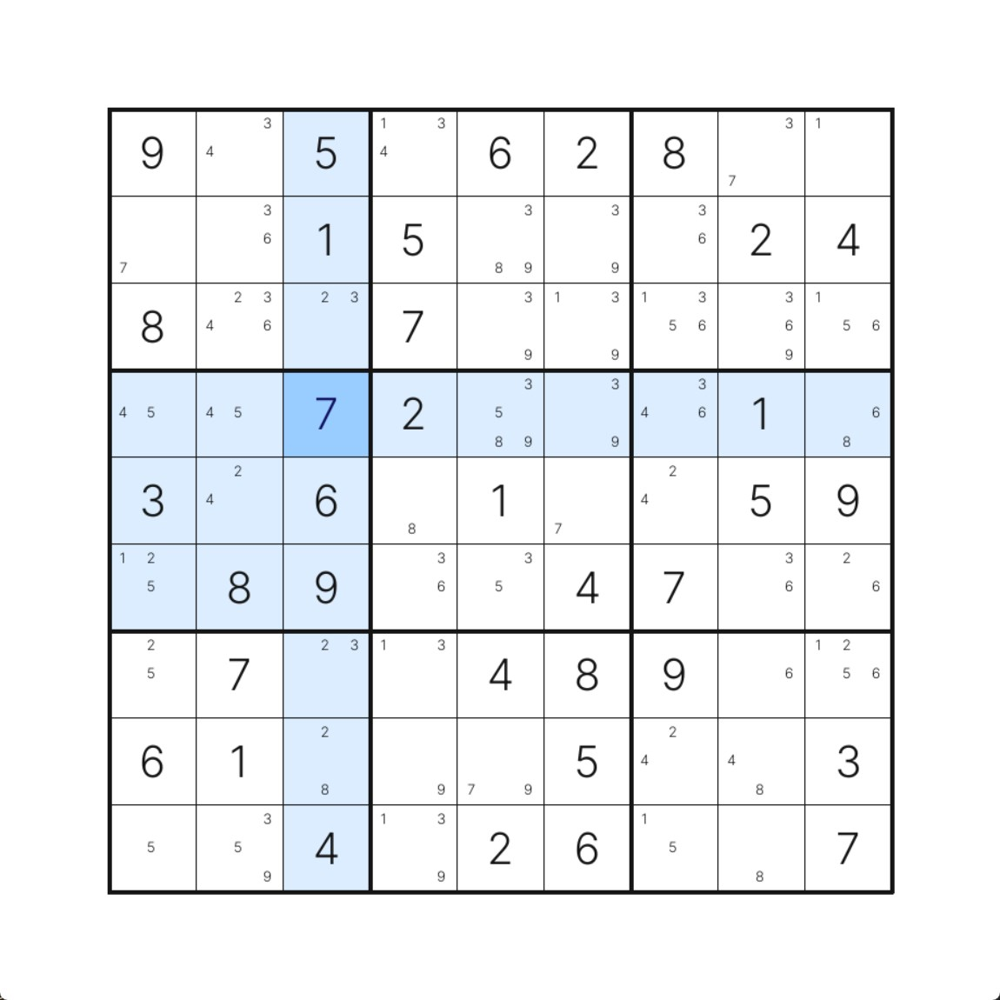
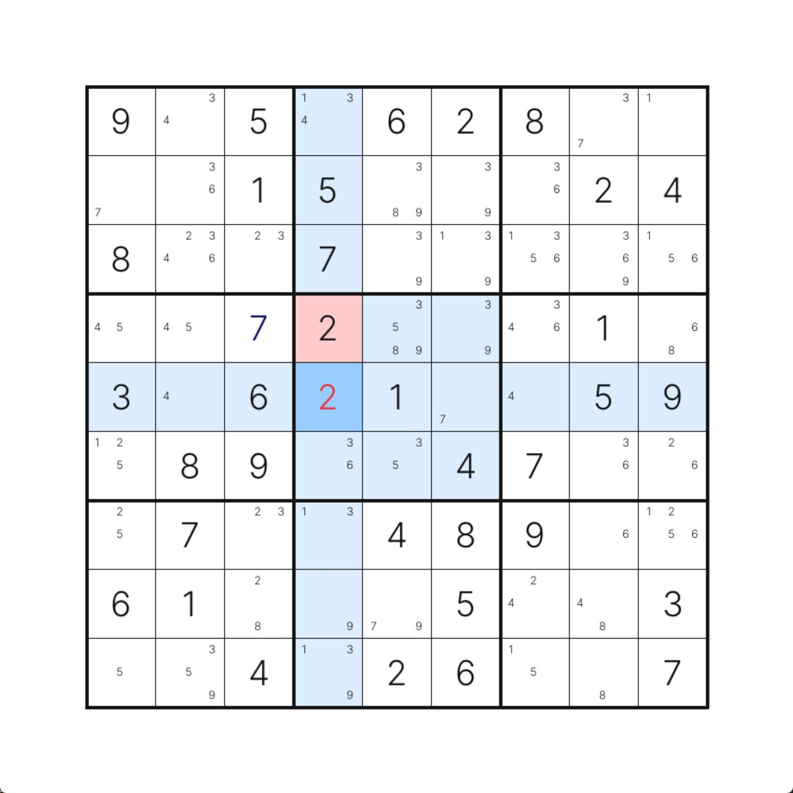
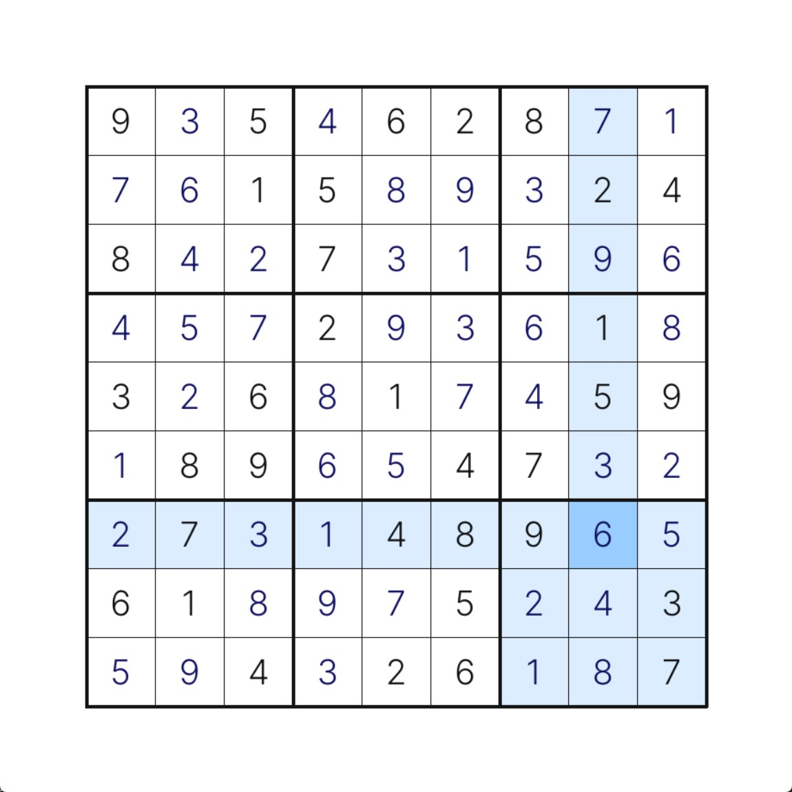

# sudoku
 

This is a small project for automatically generating and solving sudoku puzzles. It comes with a pygame GUI that allows for easy puzzle entry or generation; and solving manually, with hints, or automatically.

 

## Setup and running

You can download a binary file from the [latest release](https://github.com/ClubiNew/sudoku/releases) or run the code directly:

1. Clone the repository
2. Ensure you have Python 3.12 installed
3. Run `make install` to retrieve pip dependencies
4. Run [src/gui.py](src/gui.py) to launch the graphical interface

Controls and other information can be found within the GUI.
